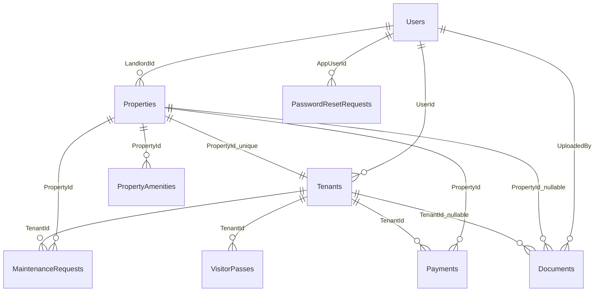

# 数据库设计说明（MyMvcApp）

本文档基于当前 EF Core 模型与 Migration 状态整理，目标是明确每张表的主键（PK）与外键（FK）关系。

## 1. 表清单

- Users
- Properties
- PropertyAmenities
- Tenants
- Documents
- MaintenanceRequests
- Payments
- VisitorPasses
- PasswordResetRequests
- CommunityUpdates

## 2. 主键与外键关系总览

### 2.1 PK（主键）

- Users: `Id`
- Properties: `PropertyId`
- PropertyAmenities: `AmenityId`
- Tenants: `TenantId`
- Documents: `DocumentId`
- MaintenanceRequests: `RequestId`
- Payments: `PaymentId`
- VisitorPasses: `VisitorPassId`
- PasswordResetRequests: `PasswordResetRequestId`
- CommunityUpdates: `Id`

### 2.2 FK（外键）

- Properties.`LandlordId` -> Users.`Id`（Cascade）
- PropertyAmenities.`PropertyId` -> Properties.`PropertyId`（Cascade）
- Tenants.`UserId` -> Users.`Id`（Cascade）
- Tenants.`PropertyId` -> Properties.`PropertyId`（Restrict，且唯一索引）
- Documents.`UploadedBy` -> Users.`Id`（Cascade）
- Documents.`PropertyId` -> Properties.`PropertyId`（可空）
- Documents.`TenantId` -> Tenants.`TenantId`（可空）
- MaintenanceRequests.`TenantId` -> Tenants.`TenantId`（Cascade）
- MaintenanceRequests.`PropertyId` -> Properties.`PropertyId`（Cascade）
- Payments.`TenantId` -> Tenants.`TenantId`（Cascade）
- Payments.`PropertyId` -> Properties.`PropertyId`（Cascade）
- VisitorPasses.`TenantId` -> Tenants.`TenantId`（Cascade）
- PasswordResetRequests.`AppUserId` -> Users.`Id`（SetNull，可空）
- CommunityUpdates：无外键

## 3. 关系基数（Cardinality）

- Users 1 -> N Properties（房东可拥有多套房）
- Users 1 -> N Tenants（一个用户可对应租户记录，当前未做唯一限制）
- Properties 1 -> 1 Tenants（通过 Tenants.PropertyId 唯一索引实现）
- Properties 1 -> N PropertyAmenities
- Properties 1 -> N MaintenanceRequests
- Properties 1 -> N Payments
- Properties 1 -> N Documents（Document 的 PropertyId 可空）
- Tenants 1 -> N MaintenanceRequests
- Tenants 1 -> N Payments
- Tenants 1 -> N VisitorPasses
- Tenants 1 -> N Documents（Document 的 TenantId 可空）
- Users 1 -> N PasswordResetRequests（通过 AppUserId，可空且删除用户时置空）

## 4. 删除行为说明（OnDelete）

- Cascade：
  - 删除 Users 会级联到 Properties、Tenants、Documents（UploadedBy）
  - 删除 Properties 会级联到 PropertyAmenities、MaintenanceRequests、Payments
  - 删除 Tenants 会级联到 MaintenanceRequests、Payments、VisitorPasses
- Restrict：
  - Tenants.PropertyId -> Properties.PropertyId
  - 表示存在 Tenant 记录时，不能直接删除对应 Property
- SetNull：
  - PasswordResetRequests.AppUserId -> Users.Id
  - 删除用户后，请求记录保留，AppUserId 置空
- No Action（默认可空外键）：
  - Documents.PropertyId 与 Documents.TenantId 允许为空，不做强级联删除

## 5. ER 关系图（Mermaid）

## 6. 各表字段（简版）

### 6.1 Users
- `Id` (PK)
- `Email`
- `Role`
- `IsApproved`
- `IsDisabled`

### 6.2 Properties
- `PropertyId` (PK)
- `LandlordId` (FK -> Users.Id)
- `PropertyName`, `PropertyType`
- 地址字段：`AddressLine1`, `AddressLine2`, `City`, `State`, `PostalCode`
- 房屋字段：`FloorNumber`, `UnitNumber`, `SizeSqFt`, `Bedrooms`, `Bathrooms`
- 金额字段：`MonthlyRent`, `DepositAmount`
- 其他：`ParkingBay`, `Description`, `CreatedAt`, `UpdatedAt`

### 6.3 Tenants
- `TenantId` (PK)
- `UserId` (FK -> Users.Id)
- `PropertyId` (FK -> Properties.PropertyId, Unique)
- `LeaseStartDate`, `LeaseEndDate`, `MonthlyRent`
- `DepositPaid`, `DepositStatus`, `RentDueDay`, `LeaseStatus`
- `Notes`, `CreatedAt`, `UpdatedAt`

### 6.4 PropertyAmenities
- `AmenityId` (PK)
- `PropertyId` (FK -> Properties.PropertyId)
- `AmenityName`

### 6.5 MaintenanceRequests
- `RequestId` (PK)
- `TenantId` (FK -> Tenants.TenantId)
- `PropertyId` (FK -> Properties.PropertyId)
- `Title`, `Category`, `Priority`, `Description`, `Status`
- `PreferredDate`, `ResolvedDate`, `LandlordRemarks`
- `CreatedAt`, `UpdatedAt`

### 6.6 Payments
- `PaymentId` (PK)
- `TenantId` (FK -> Tenants.TenantId)
- `PropertyId` (FK -> Properties.PropertyId)
- `PaymentMonth`, `PaymentYear`, `Amount`, `DueDate`, `PaymentDate`
- `PaymentMethod`, `ReferenceNo`, `ReceiptFileKey`, `Status`, `LandlordRemarks`
- `CreatedAt`, `UpdatedAt`

### 6.7 Documents
- `DocumentId` (PK)
- `UploadedBy` (FK -> Users.Id)
- `PropertyId` (FK -> Properties.PropertyId, nullable)
- `TenantId` (FK -> Tenants.TenantId, nullable)
- `DocumentName`, `DocumentType`, `FileKey`
- `FileSize`, `FileType`, `S3BucketName`, `S3Url`, `Notes`, `IsDeleted`
- `CreatedAt`, `UpdatedAt`

### 6.8 VisitorPasses
- `VisitorPassId` (PK)
- `TenantId` (FK -> Tenants.TenantId)
- `VisitorName`, `VisitorPhone`, `Purpose`, `VisitDate`
- `PassCode`, `QrPayload`, `Notes`, `Status`
- `CreatedAt`, `UpdatedAt`

### 6.9 PasswordResetRequests
- `PasswordResetRequestId` (PK)
- `Email`
- `AppUserId` (FK -> Users.Id, nullable)
- `Status`, `RequestedAt`, `ReviewedAt`, `ReviewedByEmail`

### 6.10 CommunityUpdates
- `Id` (PK)
- `Type`, `Title`, `Description`, `ImageUrl`
- `CreatedAt`, `EndDate`, `CallToActionText`, `CallToActionUrl`

## 7. 当前完整性检查结论

- 目前主要业务表均已定义主键。
- 主要关联关系均已通过外键连接。
- 特殊设计点：`Tenants.PropertyId` 为唯一外键，形成 Property 与 Tenant 的一对一约束。
- 文档与实现一致，可用于团队开发与交付说明。
