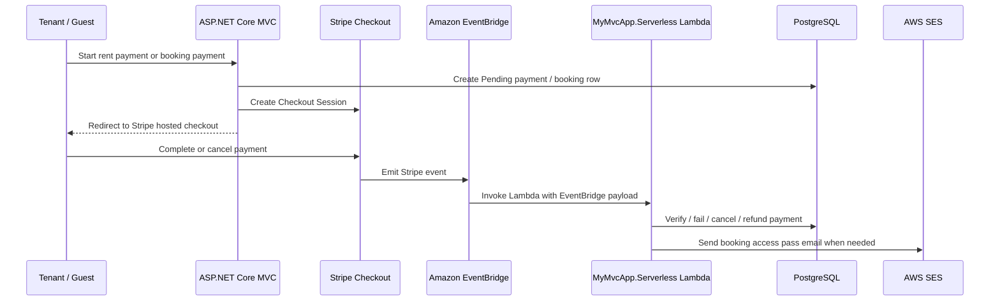

# Payment / Stripe / EventBridge Notes

这份文档说明 PropEase 的 payment flow，重点是 Stripe Checkout、MVC controller、AWS EventBridge、serverless Lambda worker，以及 EventBridge 怎样把 Stripe event call 到处理端。

## 1. High Level Flow

项目里 payment 不是单纯由 browser redirect 决定成功或失败。用户付款后，真正可信的确认来自 Stripe event。Stripe event 通过 Amazon EventBridge 送到后端，再由 MVC endpoint 或 `.NET Lambda` worker 更新 PostgreSQL。



当前代码支持两种 Stripe event 接收方式：

- Recommended production path: Stripe -> EventBridge -> `MyMvcApp.Serverless` Lambda -> PostgreSQL.
- Internal HTTP path: Stripe/EventBridge/Lambda -> `POST /api/stripe-eventbridge` or `POST /api/stripe-eventbridge/stripe-confirm` -> MVC service -> PostgreSQL.

Lambda path 比较适合 AWS serverless deployment，因为它不依赖 MVC container 当时是否正在处理 external webhook request。MVC endpoint path 适合作为 internal callback 或 fallback。

## 2. Main Files

| Area | File | Purpose |
| --- | --- | --- |
| MVC startup | `MyMvcApp/Program.cs` | 注册 Stripe API key、DbContext、AWS SDK、`StripeEventBridgeProcessingService` |
| Tenant rent checkout | `MyMvcApp/Controllers/TenantController.cs` | 创建租客租金 Stripe Checkout session |
| Guest booking checkout | `MyMvcApp/Controllers/PropertyBookingController.cs` | 创建短租 booking Stripe Checkout session |
| MVC EventBridge endpoint | `MyMvcApp/Controllers/StripeEventBridgeController.cs` | 接收 EventBridge/MVC internal payment callback |
| MVC payment processor | `MyMvcApp/Services/StripeEventBridgeProcessingService.cs` | 解析 Stripe event 并更新 payment/booking/refund |
| Lambda entry point | `MyMvcApp.Serverless/Function.cs` | AWS Lambda handler，接收 EventBridge event |
| Lambda processor | `MyMvcApp.Serverless/StripeEventProcessor.cs` | Lambda 版 Stripe event 处理逻辑 |
| Lambda data model | `MyMvcApp.Serverless/StripeWorkerModels.cs` | Lambda 使用的轻量 DbContext 和 entity |
| Payment model | `MyMvcApp/Models/Payment.cs` | Payment table 字段和状态 |

## 3. Configuration

MVC app 需要这些配置：

```json
{
  "ConnectionStrings": {
    "DefaultConnection": "Host=...;Database=...;Username=...;Password=..."
  },
  "Stripe": {
    "SecretKey": "sk_test_or_live_xxx",
    "PublishableKey": "pk_test_or_live_xxx"
  },
  "EventBridge": {
    "SharedSecret": "optional-shared-secret-for-http-eventbridge-callback"
  },
  "InternalApi": {
    "Key": "shared-secret-for-lambda-to-mvc-callback"
  },
  "AWS": {
    "Region": "ap-southeast-1",
    "BucketName": "propease-community-images-2026",
    "SesSenderEmail": "verified-ses-sender@example.com"
  }
}
```

Lambda worker also needs environment variables or `appsettings.json` values:

```text
ConnectionStrings__DefaultConnection=...
Stripe__SecretKey=...
AWS__Region=ap-southeast-1
AWS__BucketName=propease-community-images-2026
AWS__SesSenderEmail=verified-ses-sender@example.com
```

Important:

- `Stripe:SecretKey` is used by `SessionService` to create Checkout sessions and by processors to resolve receipt URLs from Stripe.
- `InternalApi:Key` protects `POST /api/stripe-eventbridge/stripe-confirm`.
- `EventBridge:SharedSecret` protects `POST /api/stripe-eventbridge` if the EventBridge-to-HTTP path is used.
- Never commit real Stripe secret keys, database passwords, or internal API keys.

## 4. MVC Startup

`Program.cs` configures Stripe globally:

```csharp
StripeConfiguration.ApiKey = builder.Configuration["Stripe:SecretKey"];
```

It also registers:

```csharp
builder.Services.AddScoped<StripeEventBridgeProcessingService>();
builder.Services.AddDbContext<AppDbContext>(...);
builder.Services.AddDefaultAWSOptions(builder.Configuration.GetAWSOptions());
```

That means controllers can create checkout sessions, and the MVC callback endpoint can process EventBridge payloads using the shared database context.

## 5. Rent Payment Checkout

Tenant rent payment starts in:

```text
POST /Tenant/CreateCheckoutSession
```

Controller: `TenantController.CreateCheckoutSession`.

What it does:

1. Finds the logged-in tenant by email.
2. Calculates the next rent due month.
3. Finds or creates a `Payment` row with `Pending` status.
4. Creates a Stripe Checkout session.
5. Saves `StripeSessionId` and `ReferenceNo`.
6. Redirects the tenant to `session.Url`.

The Stripe metadata is very important:

```csharp
var stripeMetadata = new Dictionary<string, string>
{
    ["paymentId"] = payment.PaymentId.ToString(...),
    ["tenantId"] = tenant.TenantId.ToString(...),
    ["propertyId"] = tenant.PropertyId.ToString(...),
    ["paymentMonth"] = monthName,
    ["paymentYear"] = year.ToString(...)
};
```

The processor later uses metadata `paymentId` to match the Stripe event back to the local `Payments` row. If metadata is missing, it falls back to `StripeSessionId` and `StripePaymentIntentId`.

Payment method:

```csharp
PaymentMethodTypes = new List<string> { "card" }
```

Currency:

```csharp
Currency = "myr"
```

Success and cancel pages:

- `GET /Tenant/PaymentSuccess?session_id={CHECKOUT_SESSION_ID}`
- `GET /Tenant/PaymentCancel?session_id={CHECKOUT_SESSION_ID}`

Important detail: success redirect only means the user returned from Stripe. The real verification is still the EventBridge event. Cancel redirect may mark a still-pending local payment as `Cancelled`.

## 6. Short-Term Booking Checkout

Guest booking payment starts in:

```text
POST /PropertyBooking/CreateCheckoutSession
```

Controller: `PropertyBookingController.CreateCheckoutSession`.

What it does:

1. Validates property availability and date overlap.
2. Calculates nights, total amount, promo discount, and final amount.
3. Creates a `PropertyBooking` row with:
   - `Status = Pending`
   - `PaymentStatus = Pending`
4. Creates a Stripe Checkout session.
5. Saves `StripeSessionId`.
6. Redirects guest to Stripe Checkout.

Booking metadata:

```csharp
Metadata = new Dictionary<string, string>
{
    { "TransactionType", "PropertyBooking" },
    { "BookingId", booking.Id.ToString() }
}
```

This metadata tells the event processor this is not a tenant rent payment. When `checkout.session.completed` arrives, the processor loads `PropertyBooking` by `BookingId`, marks it confirmed, generates a pass code, and sends an access pass email.

Booking payment methods:

```csharp
PaymentMethodTypes = new List<string> { "card", "fpx" }
```

## 7. Payment Database Fields

`Payment` includes Stripe-specific fields:

| Field | Meaning |
| --- | --- |
| `StripeSessionId` | Checkout session ID, e.g. `cs_test_...` |
| `StripePaymentIntentId` | PaymentIntent ID, e.g. `pi_...` |
| `StripeReceiptUrl` | Stripe-hosted receipt URL |
| `StripeEventId` | Last processed Stripe event ID |
| `StripeRefundId` | Refund ID |
| `RefundAmount` | Refunded amount in normal currency unit |
| `RefundDate` | Refund timestamp |
| `RefundReason` | Stripe refund reason |
| `ReferenceNo` | User-facing reference, usually session or payment intent |

Payment statuses:

```text
Pending -> Submitted -> Verified
Pending -> Cancelled
Pending/Submitted -> Failed
Verified -> Refunded
```

The database has indexes for:

- `StripeSessionId`
- `StripePaymentIntentId`
- `StripeEventId`

These indexes matter because EventBridge events are matched by Stripe IDs.

## 8. Stripe Events Handled

Both MVC service and Lambda processor handle these event types:

| Stripe event | Action |
| --- | --- |
| `checkout.session.completed` | Verify rent payment or confirm property booking |
| `checkout.session.async_payment_failed` | Mark payment `Failed` |
| `checkout.session.expired` | Mark payment `Cancelled` |
| `payment_intent.succeeded` | Mark payment `Verified` |
| `payment_intent.payment_failed` | Mark payment `Failed` |
| `charge.refunded` | Mark payment `Refunded` |
| `refund.created` | Mark payment `Refunded` |
| `refund.updated` | Mark payment `Refunded` |
| other events | Return OK with `{ ignored = true }` |

Matching order for rent payments:

1. `metadata.paymentId`
2. `StripeSessionId`
3. `StripePaymentIntentId`

For booking:

1. `metadata.TransactionType == "PropertyBooking"`
2. `metadata.BookingId`

## 9. EventBridge Payload Shape

EventBridge usually wraps the Stripe event inside `detail`.

Example shape:

```json
{
  "version": "0",
  "id": "eventbridge-event-id",
  "detail-type": "checkout.session.completed",
  "source": "aws.partner/stripe.com/...",
  "account": "123456789012",
  "time": "2026-04-27T10:00:00Z",
  "region": "ap-southeast-1",
  "detail": {
    "id": "evt_123",
    "type": "checkout.session.completed",
    "data": {
      "object": {
        "id": "cs_test_123",
        "payment_status": "paid",
        "payment_intent": "pi_123",
        "metadata": {
          "paymentId": "42"
        }
      }
    }
  }
}
```

The processor intentionally supports both shapes:

- EventBridge envelope: `payload.detail`
- Raw Stripe event: `payload`

This is done by `GetStripeEvent(payload)`.

## 10. Serverless Lambda Worker

Lambda project:

```text
MyMvcApp.Serverless
```

Target framework:

```xml
<TargetFramework>net8.0</TargetFramework>
<AWSProjectType>Lambda</AWSProjectType>
```

Handler method:

```csharp
public async Task<StripeEventLambdaResponse> FunctionHandler(
    JsonElement payload,
    ILambdaContext context)
```

AWS handler name should point to:

```text
MyMvcApp.Serverless::MyMvcApp.Serverless.Function::FunctionHandler
```

What Lambda does on cold start:

1. Builds configuration from `appsettings.json` and environment variables.
2. Sets `StripeConfiguration.ApiKey`.
3. Registers logging.
4. Registers `StripeWorkerDbContext`.
5. Registers `StripeEventProcessor`.

What Lambda does per event:

1. Reads `EventType` and `EventId`.
2. Calls `StripeEventProcessor.ProcessEventBridgeEventAsync(payload)`.
3. Logs success/warning/error to CloudWatch.
4. Returns a compact response containing status, event ID, event type, message, and body.

Lambda uses `StripeWorkerDbContext`, a lighter database model. This is intentional: the serverless project only needs payment, booking, property, and audit tables, not the full MVC app.

## 11. How To Connect Stripe To EventBridge

There are two AWS-side pieces:

1. Stripe partner event source sends events into EventBridge.
2. EventBridge rule routes selected events to Lambda.

Typical setup:

1. In Stripe Dashboard, enable Amazon EventBridge as an event destination.
2. In AWS EventBridge, associate the Stripe partner event source with an event bus.
3. Create an EventBridge rule on that event bus.
4. Set the target to the `MyMvcApp.Serverless` Lambda function.
5. Allow EventBridge to invoke the Lambda.

The exact partner event source name depends on the Stripe/AWS connection. It usually looks like:

```text
aws.partner/stripe.com/{account-or-destination-id}
```

Recommended EventBridge rule event pattern:

```json
{
  "source": [{ "prefix": "aws.partner/stripe.com" }],
  "detail-type": [
    "checkout.session.completed",
    "checkout.session.async_payment_failed",
    "checkout.session.expired",
    "payment_intent.succeeded",
    "payment_intent.payment_failed",
    "charge.refunded",
    "refund.created",
    "refund.updated"
  ]
}
```

If AWS receives Stripe events with the real Stripe type under `detail.type` instead of `detail-type`, use:

```json
{
  "source": [{ "prefix": "aws.partner/stripe.com" }],
  "detail": {
    "type": [
      "checkout.session.completed",
      "checkout.session.async_payment_failed",
      "checkout.session.expired",
      "payment_intent.succeeded",
      "payment_intent.payment_failed",
      "charge.refunded",
      "refund.created",
      "refund.updated"
    ]
  }
}
```

Use whichever pattern matches the actual event shown in EventBridge test event / CloudWatch log. The code itself can read event type from either `detail.type` or top-level `detail-type`.

## 12. Example AWS CLI Setup

Create or update a rule:

```bash
aws events put-rule \
  --name propease-stripe-payment-events \
  --event-bus-name "aws.partner/stripe.com/example" \
  --event-pattern file://stripe-event-pattern.json \
  --state ENABLED \
  --region ap-southeast-1
```

Attach Lambda as target:

```bash
aws events put-targets \
  --rule propease-stripe-payment-events \
  --event-bus-name "aws.partner/stripe.com/example" \
  --targets "Id"="StripePaymentLambda","Arn"="arn:aws:lambda:ap-southeast-1:123456789012:function:propease-stripe-worker" \
  --region ap-southeast-1
```

Allow EventBridge to invoke Lambda:

```bash
aws lambda add-permission \
  --function-name propease-stripe-worker \
  --statement-id AllowEventBridgeStripePayments \
  --action lambda:InvokeFunction \
  --principal events.amazonaws.com \
  --source-arn arn:aws:events:ap-southeast-1:123456789012:rule/aws.partner/stripe.com/example/propease-stripe-payment-events \
  --region ap-southeast-1
```

Replace:

- `aws.partner/stripe.com/example`
- AWS account ID
- Lambda function name
- region

## 13. EventBridge To MVC HTTP Endpoint Option

The MVC controller endpoint is:

```text
POST /api/stripe-eventbridge
```

It expects the EventBridge/Stripe JSON payload as the body.

If `EventBridge:SharedSecret` is configured, the request must include:

```text
X-EventBridge-Secret: <shared-secret>
```

This path then calls:

```csharp
StripeEventBridgeProcessingService.ProcessEventBridgeEventAsync(payload)
```

This is useful if an EventBridge API Destination, webhook relay, or another Lambda forwards the event to MVC. Direct EventBridge Lambda target is simpler for the current project.

Example internal call:

```bash
curl -X POST "https://your-domain.com/api/stripe-eventbridge" \
  -H "Content-Type: application/json" \
  -H "X-EventBridge-Secret: your-secret" \
  --data @stripe-event.json
```

## 14. Lambda To MVC Normalized Confirmation Option

There is also an internal normalized confirmation endpoint:

```text
POST /api/stripe-eventbridge/stripe-confirm
```

Header:

```text
X-Internal-Api-Key: <InternalApi:Key>
```

Body:

```json
{
  "paymentId": 42,
  "stripeSessionId": "cs_test_123",
  "stripePaymentIntentId": "pi_123",
  "stripeEventId": "evt_123",
  "stripeReceiptUrl": "https://pay.stripe.com/receipts/...",
  "paidAt": "2026-04-27T10:00:00Z"
}
```

This endpoint calls:

```csharp
StripeEventBridgeProcessingService.ConfirmPaymentAsync(request)
```

Use this if a separate Lambda normalizes Stripe events and wants MVC to perform the final payment update. In the current `.NET Lambda` worker, this extra callback is not required because Lambda updates PostgreSQL directly.

## 15. Booking Email And QR Pass

For `PropertyBooking`, `checkout.session.completed` does extra work:

1. Mark booking `PaymentStatus = Paid`.
2. Mark booking `Status = Confirmed`.
3. Save `StripePaymentIntentId` and `StripeSessionId`.
4. Generate an 8-character pass code.
5. Generate QR image.
6. Upload QR image to S3.
7. Send access pass email with SES.

Lambda uses:

- `AWSSDK.S3`
- `AWSSDK.SimpleEmail`
- `QRCoder`

Required AWS config:

- `AWS:Region`
- `AWS:BucketName`
- `AWS:SesSenderEmail`

SES sender must be verified, and in SES sandbox the guest recipient must also be verified.

## 16. Logging And Monitoring

MVC path:

- Controller logs errors through `ILogger<StripeEventBridgeController>`.
- `AWSXRayRecorder` creates a subsegment named `ProcessStripeEventBridgeWebhook`.
- Event ID and event type are added as X-Ray annotations.

Lambda path:

- Lambda logs to CloudWatch Logs.
- Success logs include event type and event ID.
- Non-2xx processing result logs warning.
- Exception logs error and rethrows, allowing Lambda/EventBridge retry behavior.

Recommended alarms:

- Lambda `Errors > 0`.
- Lambda repeated throttles.
- Lambda duration near timeout.
- EventBridge failed invocations.
- Dead-letter queue message count, if DLQ is configured.

SNS can be attached to those CloudWatch alarms to notify the team.

## 17. Local / Manual Testing

Test MVC endpoint with a saved sample event:

```bash
curl -X POST "https://localhost:5001/api/stripe-eventbridge" \
  -H "Content-Type: application/json" \
  -H "X-EventBridge-Secret: dev-secret" \
  --data @stripe-event.json
```

Test Lambda locally by invoking the handler with a JSON payload if using AWS Lambda test tools. The payload can be the same EventBridge envelope shown above.

Important test cases:

- Rent `checkout.session.completed` with `metadata.paymentId`.
- Rent `payment_intent.succeeded` with payment intent metadata.
- Failed payment event.
- Expired checkout event.
- Booking checkout with `TransactionType = PropertyBooking`.
- Refund event.
- Event for unknown local payment should return `404`, which helps reveal missing metadata or wrong database.

## 18. Common Problems

| Symptom | Likely cause | Check |
| --- | --- | --- |
| Payment stays `Pending` | EventBridge rule not firing, Lambda failed, wrong DB connection | CloudWatch logs, EventBridge metrics, Lambda env vars |
| Processor returns `404` | Stripe event cannot match local payment | Check `metadata.paymentId`, `StripeSessionId`, `StripePaymentIntentId` |
| Receipt URL empty | Event did not include charge or Stripe key unavailable | Check `Stripe:SecretKey`, PaymentIntent expansion |
| MVC endpoint returns `401` | Missing/wrong shared secret | `X-EventBridge-Secret` or `X-Internal-Api-Key` |
| Booking paid but no email | SES sender/recipient not verified, missing config, SES failure | CloudWatch logs, `AWS:SesSenderEmail`, SES sandbox |
| EventBridge invokes but Lambda times out | Database network/security group issue | Lambda VPC/subnet/security group/RDS access |
| Duplicate events | Stripe/EventBridge retry behavior | Processing should be idempotent by updating same payment row |

## 19. Deployment Checklist

Before production:

- Stripe test mode flow works end-to-end.
- `Payment` rows save `StripeSessionId` after checkout creation.
- Stripe metadata includes `paymentId` for rent payment.
- Booking metadata includes `TransactionType` and `BookingId`.
- Lambda has correct `ConnectionStrings__DefaultConnection`.
- Lambda can reach PostgreSQL from its VPC/network.
- Lambda has IAM permission for CloudWatch Logs.
- Booking Lambda has S3 `PutObject` permission for QR pass uploads.
- Booking Lambda has SES `SendEmail` permission.
- EventBridge partner source is associated.
- EventBridge rule target is the Lambda function.
- `lambda:add-permission` has allowed EventBridge invocation.
- CloudWatch alarm and SNS notification are configured for Lambda/EventBridge failure.

## 20. Short Explanation For Presentation

The MVC app creates Stripe Checkout sessions and stores a local pending payment or booking. The browser redirect only controls the user experience; it is not trusted as final proof of payment. Stripe emits payment events to Amazon EventBridge. EventBridge routes those events to a .NET Lambda worker, which reads the Stripe event, matches it to the local database row using metadata or Stripe IDs, and updates payment status to verified, failed, cancelled, or refunded. For short-term bookings, the Lambda also creates a pass code, uploads a QR pass to S3, and sends the guest an SES email. CloudWatch and X-Ray help trace failures, while SNS can notify the team when event delivery or Lambda processing fails.
