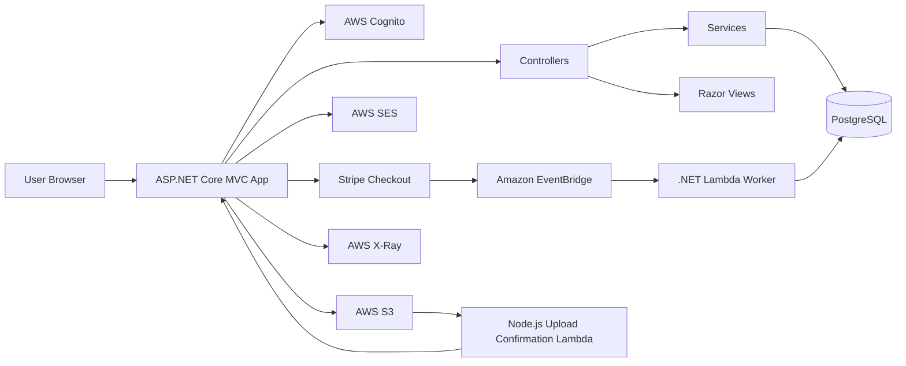
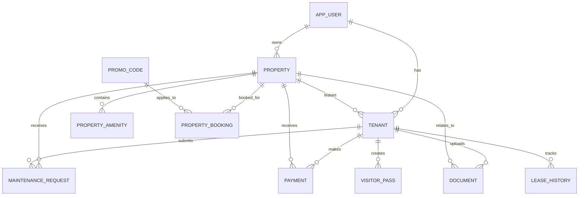
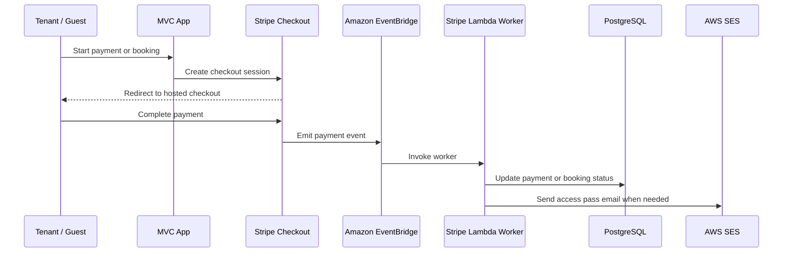
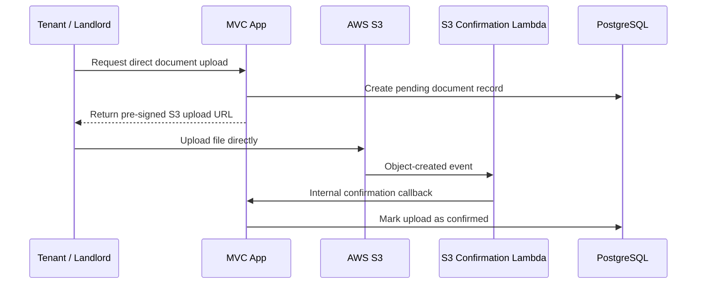

# PropEase 项目结构 Presentation Notes

## 1. 项目简介

PropEase 是一个使用 ASP.NET Core MVC 开发的物业管理系统，主要服务于不同身份的用户：

- Admin：平台管理、用户审批、房源审批、付款监控、公告管理、审计记录。
- Landlord：房源管理、租客分配、租约管理、维修跟进、文件管理。
- Tenant：租客仪表板、租金付款、维修申请、访客通行证、文件上传、公告查看。
- Security：访客通行证验证与 check-in。
- Guest：短租房源浏览、预订和 Stripe 付款。

这个项目把传统 MVC Web Application 和 AWS Serverless 架构结合起来。主系统负责用户界面和核心业务流程，Stripe 付款确认和 S3 文件上传确认则交给 Lambda 处理。

## 2. Repository 结构

```text
SuperNiubi_AWS_PROJECT/
├── MyMvcApp/                                # 主要 ASP.NET Core MVC 应用
│   ├── Controllers/                         # 处理 request 和业务流程
│   ├── Models/                              # 数据模型和 ViewModel
│   ├── Views/                               # Razor 页面，按功能/角色分类
│   ├── Data/                                # Entity Framework Core DbContext
│   ├── Services/                            # 可复用的业务服务
│   ├── Extensions/                          # Authentication 和 middleware 扩展
│   ├── Migrations/                          # EF Core 数据库迁移文件
│   ├── wwwroot/                             # 静态资源：CSS、JS、图片、前端库
│   ├── Program.cs                           # 应用启动和依赖注入配置
│   └── MyMvcApp.csproj                      # 主 Web 项目的配置和依赖
├── MyMvcApp.Serverless/                     # .NET AWS Lambda，用来处理 Stripe EventBridge 事件
├── S3-document-upload-confirmation-serverless/
│   └── index.mjs                            # Node.js Lambda，用来确认 S3 文件上传
├── docker-compose.ec2.yml                   # EC2/container 部署配置
├── nginx.conf.example                       # Nginx reverse proxy 示例
└── dotNET.sln                               # Visual Studio solution 文件
```

## 3. 高层架构



主 MVC 应用负责用户看到和操作的功能。Stripe 和 S3 这类外部系统会触发 serverless function，再由 Lambda 更新数据库或回调 MVC 的 internal API。

## 4. 主应用层：Program.cs

`MyMvcApp/Program.cs` 是整个 MVC 应用的启动文件，负责配置应用需要的服务和 middleware。

它主要配置：

- MVC controllers 和 Razor views。
- PostgreSQL database，通过 Entity Framework Core 和 Npgsql 连接。
- AWS services，包括 Cognito、S3、Secrets Manager。
- AWS X-Ray tracing，用来追踪 request 和 AWS SDK 调用。
- Stripe API key。
- Cookie authentication。
- DataProtection key persistence，确保 container restart 后 login cookie 仍然有效。
- Forwarded headers，支持 Nginx 或 load balancer 后面的部署环境。
- 项目自定义 services 的 dependency injection。

注册的主要 custom services：

- `EmailService`
- `StripeEventBridgeProcessingService`
- `DocumentUploadService`
- `InternalApiKeyProvider`
- `RoleClaimsTransformation`
- `S3ImageService`

## 5. MVC 文件夹职责

### Controllers

Controllers 负责接收 request，并协调数据库、service 和 view。

- `AccountController`：登录、注册、登出、密码重置请求、身份检查。
- `GoogleLoginController`：Google OAuth 登录流程。
- `AdminController`：Admin dashboard、用户审批、房源审批、公告、审计。
- `AdminPaymentController`：付款监控、付款验证、付款拒绝、CSV 导出。
- `LandlordController`：房源 CRUD、租客分配、租约管理、维修、文件、公告。
- `TenantController`：租客 dashboard、房源信息、维修申请、文件、付款、访客通行证。
- `CommunityAdminController`：社区公告/更新管理。
- `PropertyBookingController`：公开短租预订和 Stripe checkout。
- `PropertyGuardController`：房源访问通行证验证。
- `StripeEventBridgeController`：处理 Stripe/EventBridge 内部付款事件。
- `DocumentUploadEventsController`：处理 S3 上传确认事件。
- `HomeController`：首页和公共页面。

### Models

Models 包含 database entity 和 view model。

核心 database entities：

- `AppUser`
- `Property`
- `PropertyAmenity`
- `Tenant`
- `LeaseHistory`
- `MaintenanceRequest`
- `MaintenanceTimeline`
- `Payment`
- `Document`
- `CommunityUpdate`
- `VisitorPass`
- `PasswordResetRequest`
- `AuditLog`
- `SystemAnnouncement`
- `PropertyBooking`
- `PromoCode`

ViewModel 用来给页面准备数据，例如 Admin dashboard、Tenant dashboard、Landlord documents、Payment list 和 Maintenance form。

### Views

Views 使用 Razor `.cshtml` 文件实现 UI，并按功能分组：

- `Views/Account`：登录、注册、Access Denied、Pending Approval。
- `Views/Admin`：Admin dashboard 和不同管理区域的 partial views。
- `Views/AdminPayment`：付款列表和付款详情。
- `Views/Landlord`：房东 dashboard、房源、租客、维修、付款、文件。
- `Views/Tenant`：租客 dashboard、房源、维修、文件、付款、访客。
- `Views/CommunityAdmin`：社区更新的 CRUD 页面。
- `Views/PropertyBooking`：预订、成功、取消页面。
- `Views/PropertyGuard`：访客/房源 pass 验证。
- `Views/Shared`：共用 layout、error page、validation scripts。

## 6. Database Design

数据库由 Entity Framework Core 管理，核心文件是 `AppDbContext`。



数据库设计重点：

- Enum 会以 string 形式存在数据库里，比较容易 debug 和阅读。
- 针对常用查询字段建立 index，例如 Stripe ID、document upload status、property status、audit log、lease history。
- 根据业务规则配置 cascade delete、restrict delete 和 set null。
- `Migrations/` 记录数据库 schema 的演进过程。

## 7. Authentication 和 Authorization

系统使用 AWS Cognito Identity，并结合 ASP.NET Core authentication。

主要 authentication 功能：

- Email/password login。
- Google OAuth login。
- Application cookie。
- DataProtection keys 持久化，避免 container restart 后 cookie 无法解密。
- 使用 `[Authorize]` 做角色权限控制。
- 使用 `RoleClaimsTransformation` 把用户角色加入 claims。

主要角色：

- `Admin`
- `Landlord`
- `Tenant`
- `Security`

## 8. Extensions 的作用

`Extensions` 文件夹主要用来放一些可以复用的配置或 middleware，让 `Program.cs` 不会太乱。

### GoogleAuthenticationExtensions

`GoogleAuthenticationExtensions.cs` 定义了：

```csharp
builder.Services.AddGoogleLogin(builder.Configuration);
```

它会从 configuration 读取：

```text
Authentication:Google:ClientId
Authentication:Google:ClientSecret
```

如果 Google credentials 存在，就启用 Google OAuth login。如果没有配置，就直接跳过，不会让应用启动失败。

可以这样理解：

> GoogleAuthenticationExtensions 把 Google OAuth 的注册逻辑封装起来，让主启动文件只需要调用 `AddGoogleLogin`。

### XRayUserTrackingMiddleware

`XRayUserTrackingMiddleware.cs` 是一个 middleware。它会在用户已经登录时，从当前 request 里读取：

- UserId
- UserRole

然后把这些信息加入 AWS X-Ray annotation：

```csharp
AWSXRayRecorder.Instance.AddAnnotation("UserId", userId);
AWSXRayRecorder.Instance.AddAnnotation("UserRole", role);
```

这样在 AWS X-Ray console 里可以按用户或角色过滤 request，方便 production debugging。

可以这样理解：

> XRayUserTrackingMiddleware 会把登录用户的信息写入 X-Ray trace，让开发者知道哪一个用户、哪一种角色触发了某次请求。

## 9. appsettings.json 的用途

`appsettings.json` 是 ASP.NET Core 应用的主要配置文件。它用来存放应用启动时需要读取的配置，而不是把这些值写死在 C# code 里面。

在这个项目里，`appsettings.json` 主要用于：

- Logging level。
- PostgreSQL database connection string。
- AWS region 和 service 相关设置。
- AWS Cognito user pool 设置。
- S3 bucket name。
- SES sender email。
- Stripe secret key 和 publishable key。
- EventBridge shared secret。
- Internal API key，用于 trusted server-to-server callback。

例如 Stripe key：

```csharp
StripeConfiguration.ApiKey = builder.Configuration["Stripe:SecretKey"];
```

这句会读取：

```json
{
  "Stripe": {
    "SecretKey": ""
  }
}
```

例如 database connection string：

```csharp
options.UseNpgsql(builder.Configuration.GetConnectionString("DefaultConnection"))
```

这句会读取：

```json
{
  "ConnectionStrings": {
    "DefaultConnection": ""
  }
}
```

这样做的好处是：

- Development 可以用 test database 和 test Stripe key。
- Production 可以用 real database 和 live Stripe key。
- Sensitive values 可以通过 environment variables 或 secret manager 提供，不需要 commit 到 source code。

Presentation 可以这样讲：

> `appsettings.json` stores application configuration such as database connection strings, AWS settings, Stripe keys, and logging levels. The application reads these values at runtime, so the same code can run in different environments with different configuration.

## 10. .csproj 的用途

`.csproj` 是 .NET 项目的配置文件，可以理解成 project 的说明书。

它主要负责：

- 指定项目类型，例如 Web app 或普通 .NET project。
- 指定 .NET 版本，例如 `net8.0`。
- 开启编译选项，例如 nullable checking 和 implicit usings。
- 管理 NuGet package dependencies。
- 告诉 .NET build system 如何 restore、build、publish 这个项目。

主 MVC 项目：

```xml
<Project Sdk="Microsoft.NET.Sdk.Web">
```

说明它是 ASP.NET Core Web project。

Serverless 项目：

```xml
<Project Sdk="Microsoft.NET.Sdk">
<AWSProjectType>Lambda</AWSProjectType>
```

说明它是一个 .NET project，并且目标是 AWS Lambda。

Presentation 可以这样讲：

> `.csproj` defines how a .NET project is built. It includes the target framework, project SDK, build settings, and NuGet dependencies.

## 11. MyMvcApp.Serverless 的作用

`MyMvcApp.Serverless` 是一个独立的 .NET AWS Lambda project，主要用来处理 Stripe payment event。

它不是普通 MVC 页面，而是一个 event-driven worker。

### Function.cs

`Function.cs` 是 Lambda 的入口文件。

核心方法：

```csharp
public async Task<StripeEventLambdaResponse> FunctionHandler(
    JsonElement payload,
    ILambdaContext context)
```

当 AWS Lambda 被 EventBridge 触发时，就会执行这个 method。

它负责：

- 读取 configuration。
- 设置 Stripe API key。
- 注册 logging。
- 注册 PostgreSQL DbContext。
- 注册 `StripeEventProcessor`。
- 接收 event payload。
- 把真正的 payment event 处理交给 `StripeEventProcessor`。

### StripeEventProcessor.cs

这是 Lambda 最核心的业务逻辑。

它会根据 Stripe event type 执行不同处理：

- `checkout.session.completed`：付款 checkout 完成。
- `checkout.session.async_payment_failed`：异步付款失败。
- `checkout.session.expired`：checkout session 过期。
- `payment_intent.succeeded`：付款成功。
- `payment_intent.payment_failed`：付款失败。
- `charge.refunded`：charge 已退款。
- `refund.created` / `refund.updated`：退款记录产生或更新。

它会更新：

- Payment status。
- Stripe session id。
- Stripe payment intent id。
- Receipt URL。
- Refund details。
- Property booking status。
- Audit log。

如果是短租 booking 成功，它还会生成 access pass，并通过 email 发送给 guest。

### StripeWorkerModels.cs

这个文件定义 Lambda worker 自己需要的轻量版 database models。

它包含：

- `StripeWorkerDbContext`
- `Payment`
- `PropertyBooking`
- `Property`
- `AuditLog`
- Payment 和 booking 相关 enum

为什么这里还要再定义 models？

因为 Lambda project 是独立的，它只需要知道和 Stripe payment 相关的 table，不需要加载整个 MVC app 的所有 models。

可以这样理解：

> `StripeWorkerModels.cs` provides a minimal database model for the Lambda worker, keeping the serverless project smaller and focused.

### MyMvcApp.Serverless.csproj

这是 Lambda project 的 `.csproj` 文件，负责定义：

- Target framework。
- AWS Lambda project type。
- Lambda 需要的 NuGet packages。
- PostgreSQL provider。
- Stripe SDK。
- AWS SDK。
- Email、S3、QR code 相关依赖。

## 12. 主要功能模块

### Admin Module

Admin 可以：

- Approve 或 reject users。
- Approve 或 reject property listings。
- Monitor payment status。
- Verify 或 reject payment records。
- Manage system announcements。
- View audit logs 和 dashboard analytics。

### Landlord Module

Landlord 可以：

- Add、edit、delete property listings。
- 上传 property images 到 S3。
- Assign tenants to properties。
- Renew、terminate 或 adjust lease details。
- Review tenant maintenance requests。
- 管理 property 或 tenant documents。
- 发布 landlord announcements。

### Tenant Module

Tenant 可以：

- 查看 assigned property。
- 提交 maintenance requests。
- 上传和下载 documents。
- 通过 Stripe Checkout 支付 rent。
- 注册 visitor passes。
- Cancel 或 mark visitor passes as used。
- 查看 system 和 landlord announcements。

### Public Booking Module

Guest 可以：

- 浏览 available short-term properties。
- 选择 check-in 和 check-out date。
- 使用 promo code。
- 通过 Stripe Checkout 付款。
- 付款确认后收到 access pass。

## 13. Payment Flow



付款流程使用的技术：

- Stripe Checkout 创建付款页面。
- Stripe.net SDK 调用 Stripe API。
- Amazon EventBridge 接收 Stripe event。
- .NET Lambda worker 异步处理 payment status。
- PostgreSQL 保存 payment 和 booking 结果。
- Audit log 保留系统操作记录。

## 14. Document Upload Flow



这个设计的重点是：文件不会先上传到 MVC server，而是 browser 直接上传到 S3。MVC app 只负责生成 upload URL 和保存 document metadata。

这样可以：

- 减少 MVC server 的压力。
- 更适合处理大文件。
- 通过 S3 event 和 Lambda 确认文件真的上传成功。

## 15. AWS Integration

项目使用的 AWS services：

- Cognito：用户登录和身份管理。
- S3：储存 property/community images 和 documents。
- SES：发送 email notification 和 property access pass。
- Secrets Manager：读取 internal secret。
- X-Ray：追踪 request、AWS SDK call 和 production issue。
- Lambda：处理 payment 和 upload confirmation。
- EventBridge：接收 Stripe event。

`docker-compose.ec2.yml` 里面还配置了 X-Ray daemon container，让应用可以把 trace 发送到 AWS X-Ray。

## 16. Deployment Structure

这个应用可以用 container 方式部署：

- `MyMvcApp/Dockerfile` 负责 build MVC application。
- `docker-compose.ec2.yml` 同时启动 MVC app 和 AWS X-Ray daemon。
- Host port `80` 映射到 application port `8080`。
- DataProtection keys 被 mount 到 persistent storage。
- AWS、Google OAuth、Stripe、Internal API secrets 通过 environment variables 提供。
- `nginx.conf.example` 提供 reverse proxy 部署参考。

## 17. Suggested Presentation Slide Flow

1. 项目标题和问题背景。
2. 用户角色和系统目标。
3. Repository 结构。
4. High-level architecture diagram。
5. MVC application structure。
6. Database model 和 entity relationship。
7. Authentication 和 role-based authorization。
8. Admin、Landlord、Tenant、Guest 功能模块。
9. Stripe payment flow。
10. S3 direct upload flow。
11. AWS service integration。
12. Deployment design。
13. Technical highlights 和 challenges。
14. Conclusion 和 future improvements。

## 18. Technical Highlights

- 清楚的 MVC 分层：Controllers、Models、Views、Services、Data。
- 针对不同角色设计不同 UI 和 workflow。
- 使用 EF Core migrations 管理 PostgreSQL schema。
- Direct-to-S3 upload 架构，提高文件上传 scalability。
- Stripe + EventBridge + Lambda 的异步 payment processing。
- AWS X-Ray 提供 production observability。
- Secure cookie 和 DataProtection 配置，适合 container deployment。
- Audit logging 和 admin analytics 提高系统可管理性。

## 19. Possible Future Improvements

- 为 controller 和 service workflow 添加 unit test 与 integration test。
- 将非常大的 controller 拆分成更小的 service 或 command handler。
- 为 internal callback endpoints 增加 OpenAPI documentation。
- 改进 CI/CD automation，让 deployment 和 migration 更安全。
- 增加 background jobs，自动检查 overdue payment 和 document expiry。
- 增强 Lambda failure 和 payment reconciliation 的 monitoring dashboard。

## 20. Short Speaking Script

这个项目是一个使用 ASP.NET Core MVC 开发的物业管理平台，支持 Admin、Landlord、Tenant、Security 和 Guest 等不同角色。主应用采用 MVC 架构：Controllers 负责处理 request，Models 表示业务数据，Views 负责 UI，Services 封装可复用逻辑，而 Entity Framework Core 负责和 PostgreSQL 数据库交互。

系统也集成了多个 AWS 和第三方服务。Cognito 用于用户身份认证，S3 用于储存图片和文件，SES 用于发送 email，X-Ray 用于监控和 tracing。付款方面，系统使用 Stripe Checkout，付款结果通过 Amazon EventBridge 传给 .NET Lambda worker，再由 Lambda 更新 payment 或 booking 状态。

文件上传方面，用户会直接上传到 S3，而不是先经过 MVC server。S3 上传成功后会触发 Node.js Lambda，再回调 MVC app 确认文件上传完成。整体架构结合了传统 MVC Web Application 和 cloud-native serverless workflows，让系统既清楚分层，也能处理异步付款和文件上传场景。
