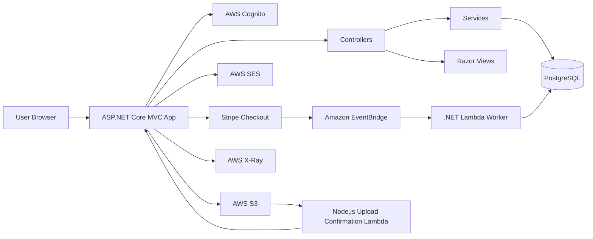
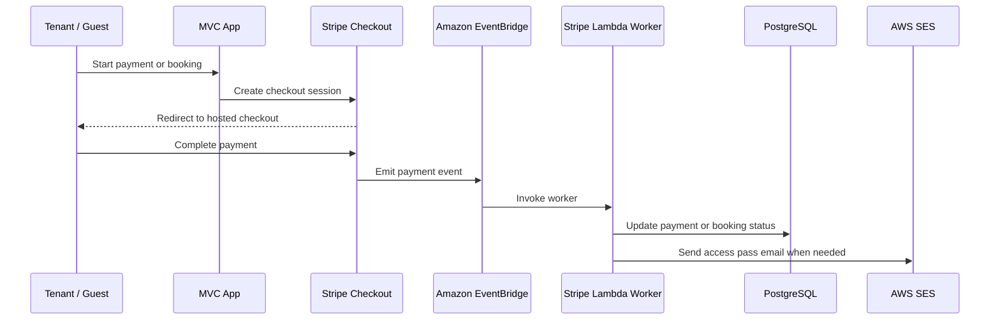
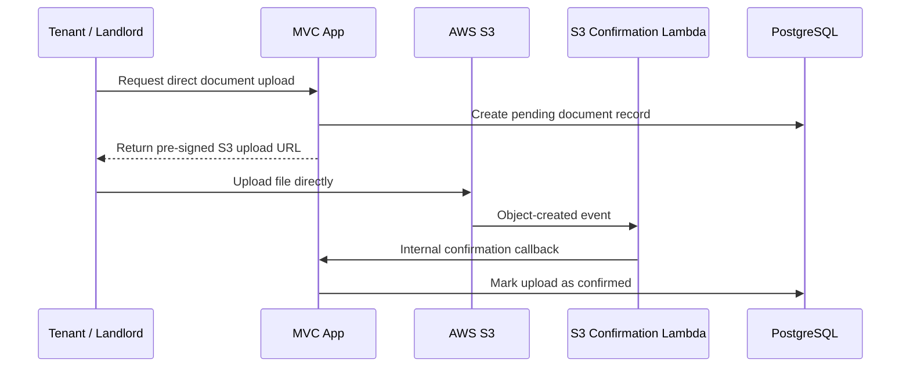

# PropEase 项目结构 Presentation Notes

## 1. 项目简介

PropEase 是一个使用 ASP.NET Core MVC 开发的物业管理系统，主要服务于不同身份的用户：

- Admin：平台管理、用户审批、房源审批、付款监控、公告管理、审计记录。
- Landlord：房源管理、租客分配、租约管理、维修跟进、文件管理。
- Tenant：租客仪表板、租金付款、维修申请、访客通行证、文件上传、公告查看。
- Security：访客通行证验证与 check-in。
- Guest：短租房源浏览、预订和 Stripe 付款。

这个项目结合了传统 MVC Web Application 和 AWS Serverless 架构。主 MVC 应用负责用户界面和核心业务流程，Stripe 付款确认和 S3 文件上传确认则交给 Lambda 处理。

## 2. Repository 总览

```text
SuperNiubi_AWS_PROJECT/
├── MyMvcApp/                                # 主要 ASP.NET Core MVC Web 应用
│   ├── Controllers/                         # Controller 层：处理 request 和业务流程
│   ├── Models/                              # Model 层：entity、ViewModel、API contract
│   ├── Views/                               # Razor 页面
│   ├── Data/                                # Entity Framework Core database context
│   ├── Services/                            # 可复用业务服务
│   ├── Extensions/                          # 扩展方法和 middleware
│   ├── Migrations/                          # EF Core database migrations
│   ├── wwwroot/                             # 静态资源
│   ├── appsettings.json                     # 应用配置
│   ├── Dockerfile                           # MVC app container build 配置
│   ├── Program.cs                           # 应用启动入口
│   └── MyMvcApp.csproj                      # 主 Web 项目配置
├── MyMvcApp.Serverless/                     # .NET Lambda，处理 Stripe EventBridge 事件
├── S3-document-upload-confirmation-serverless/
│   └── index.mjs                            # Node.js Lambda，确认 S3 文件上传
├── docs/                                    # 项目文档
├── docker-compose.ec2.yml                   # EC2/container 部署配置
├── nginx.conf.example                       # Nginx reverse proxy 示例
└── dotNET.sln                               # Visual Studio solution
```

Root level 是整个 solution 的最外层，主要负责组织多个 project 和部署配置。

- `dotNET.sln`：Visual Studio solution file，把 `MyMvcApp` 和 `MyMvcApp.Serverless` 组织在一起。
- `docker-compose.ec2.yml`：EC2/container 部署配置，启动 MVC app 和 AWS X-Ray daemon。
- `nginx.conf.example`：Nginx reverse proxy 示例，真实部署时可把外部 request 转发到 ASP.NET Core app。
- `docs/`：项目文档和 presentation notes。

## 3. 高层架构



主 MVC 应用负责用户看到和操作的功能。Stripe 和 S3 这类外部系统会触发 serverless function，再由 Lambda 更新数据库或回调 MVC 的 internal API。

## 4. MyMvcApp 主应用

`MyMvcApp` 是用户通过 browser 访问的主要 Web application。

它是一个 ASP.NET Core MVC project，包含 UI、controller、database access、authentication、business services 和 static assets。

## 5. Program.cs

`Program.cs` 是整个 MVC 应用的启动入口。

在 ASP.NET Core 里面，`Program.cs` 负责两件事：

- 注册 services：告诉 application 哪些功能可以通过 dependency injection 使用。
- 配置 middleware pipeline：决定每一个 HTTP request 进入系统后会经过哪些处理步骤。

可以把它理解成 application 的 main switchboard。它不会直接处理某一个页面的业务逻辑，但它会把 database、authentication、AWS、Stripe、MVC routing 和 custom services 全部连接起来。

### 5.1 Service Registration

第一部分是 service registration，也就是 `builder.Services...`。

它主要注册：

- MVC controllers 和 Razor views。
- PostgreSQL database，通过 Entity Framework Core 和 Npgsql 连接。
- AWS services，包括 Cognito、S3、Secrets Manager。
- AWS X-Ray tracing，用来追踪 request 和 AWS SDK 调用。
- Stripe API key。
- Cookie authentication。
- DataProtection key persistence，确保 container restart 后 login cookie 仍然有效。
- Forwarded headers，支持 Nginx 或 load balancer 后面的部署环境。
- 项目自定义 services 的 dependency injection。

MVC 和 JSON serialization：

```csharp
builder.Services.AddControllersWithViews()
    .AddJsonOptions(options =>
    {
        options.JsonSerializerOptions.Converters.Add(new JsonStringEnumConverter());
    });
```

这表示系统启用 MVC controller 和 Razor view，同时让 JSON response 里面的 enum 显示成文字，而不是数字。例如 `Approved` 会比 `1` 更清楚。

Database configuration：

```csharp
builder.Services.AddDbContext<AppDbContext>(options =>
    options.UseNpgsql(builder.Configuration.GetConnectionString("DefaultConnection"))
        .AddXRayInterceptor(true));
```

这里把 `AppDbContext` 注册进 dependency injection。Controller 或 Service 要访问 PostgreSQL 时，就可以注入 `AppDbContext`。`.AddXRayInterceptor(true)` 会把 database call 加进 AWS X-Ray trace，方便 debugging。

AWS 和第三方 service：

```csharp
AWSSDKHandler.RegisterXRayForAllServices();
StripeConfiguration.ApiKey = builder.Configuration["Stripe:SecretKey"];
builder.Services.AddDefaultAWSOptions(builder.Configuration.GetAWSOptions());
builder.Services.AddAWSService<Amazon.S3.IAmazonS3>();
builder.Services.AddAWSService<IAmazonSecretsManager>();
```

这些配置让 MVC app 可以调用 AWS SDK、Stripe API、S3 和 Secrets Manager。

注册的主要 custom services 包括：

- `EmailService`
- `StripeEventBridgeProcessingService`
- `DocumentUploadService`
- `InternalApiKeyProvider`
- `RoleClaimsTransformation`
- `S3ImageService`

这些 service 被 controller 使用，用来处理 email、payment event、document upload、internal API secret、role claims 和 S3 image upload。

### 5.2 Authentication and Cookies

`Program.cs` 也配置了 login cookie：

```csharp
builder.Services.ConfigureApplicationCookie(options =>
{
    options.LoginPath = "/Account/Login";
    options.AccessDeniedPath = "/Account/AccessDenied";
    options.SlidingExpiration = true;
    options.ExpireTimeSpan = TimeSpan.FromDays(14);
});
```

这决定了：

- 没登录的用户会去 `/Account/Login`。
- 没权限的用户会去 `/Account/AccessDenied`。
- Cookie 有效期是 14 天，并且支持 sliding expiration。
- API 或 AJAX request 如果没有权限，会返回 `401` 或 `403`，而不是跳去 HTML login page。

这里还有一个重要配置是 DataProtection：

```csharp
builder.Services.AddDataProtection()
    .PersistKeysToFileSystem(new DirectoryInfo(dataProtectionKeysPath))
    .SetApplicationName("PropEase");
```

ASP.NET Core 用 DataProtection key 来加密和解密 authentication cookie。如果这个 key 每次 container restart 都改变，用户就会突然被 logout。把 key 存到 persistent folder 后，cookie 就可以在 restart 后继续被识别。

### 5.3 Reverse Proxy Support

项目部署在 EC2、Nginx 或 AWS Load Balancer 后面时，真实 request scheme 和 client IP 通常会放在 forwarded headers 里面。

`Program.cs` 使用：

```csharp
app.UseForwardedHeaders();
```

这样 application 才知道原始 request 是 HTTPS，client IP 是谁。这个配置对 secure cookie、redirect URL 和 production deployment 很重要。

### 5.4 Middleware Pipeline

`builder.Build()` 之后，代码进入 middleware pipeline 配置。

主要顺序是：

```text
Forwarded Headers
X-Ray tracing
Exception handling / HSTS
HTTPS redirection
Static files
Routing
Authentication
Authorization
X-Ray user tracking
Controller route mapping
```

Middleware 的顺序很重要。例如：

- `UseForwardedHeaders()` 要在 authentication 和 HTTPS redirection 前面。
- `UseAuthentication()` 要在 `UseAuthorization()` 前面。
- `MapControllerRoute()` 放在最后，把 request 交给对应 controller action。

默认 route 是：

```csharp
pattern: "{controller=Home}/{action=Index}/{id?}"
```

意思是用户访问网站根目录时，会默认进入 `HomeController` 的 `Index` action。

### 5.5 Debugging and Observability

`Program.cs` 里面也有 authentication debug middleware。它只在几个关键 path 输出登录状态：

- `/Account/CheckAuth`
- `/Admin`
- `/Account/Login`

它会记录 machine name、process id、host、scheme、path、user name、cookie 是否存在和 user roles。这个设计是为了排查 production 或 container deployment 中常见的 cookie / role 问题。

另外，`app.UseXRay("MyMvcApp")` 和 `XRayUserTrackingMiddleware` 会把 request 和 user information 送到 AWS X-Ray，方便在 AWS console 里面追踪 slow request 或 error。

可以这样讲：

> `Program.cs` is the startup and configuration file of the MVC application. It registers all required services such as MVC, PostgreSQL, AWS, Stripe, authentication cookies, DataProtection, and custom business services. After that, it builds the HTTP middleware pipeline, so every request passes through forwarded headers, tracing, static files, routing, authentication, authorization, and finally the controller route.

## 6. Controllers 文件夹

`Controllers` 是 MVC 里的 C，负责接收 request、检查权限、调用 service/database，然后返回 Razor view 或 JSON response。

Controller 的核心职责：

- Page routing：决定用户进入哪个页面。
- Authorization：限制某些功能只能给 Admin、Landlord、Tenant 或 Security。
- Data coordination：从 database 读取数据，组合成 ViewModel。
- Business action：处理用户提交的表单，例如付款、维修、文件上传、审批。
- Integration callback：接收 Stripe、S3、Lambda 等外部系统传回来的事件。

### AccountController

负责普通账号流程：

- `Login`：显示登录页面，以及处理 login form。
- `Register`：处理注册。
- `Logout`：登出当前用户。
- `RequestPasswordReset`：提交密码重置请求。
- `PendingApproval`：注册后等待 admin 审批的页面。
- `AccessDenied`：没有权限时显示的页面。
- `CheckAuth`：检查当前 request 是否已经登录。

核心逻辑：authentication。它检查用户 email/password，处理登录状态，并根据账号状态决定用户能不能进入系统。

### GoogleLoginController

负责 Google OAuth login：

- `ExternalLogin`：开始 Google login，把用户 redirect 到 Google。
- `ExternalLoginCallback`：Google 登录完成后回调到这里。

核心逻辑：external authentication。用户通过 Google 证明身份，然后系统再决定是否创建或登录对应用户。

### AdminController

负责 Admin dashboard 和平台管理，只允许 `Admin` 角色访问：

- `Admin` / `Dashboard`：显示 admin dashboard 和统计资料。
- `ApproveProperty` / `RejectProperty`：审批或拒绝房源。
- `ApproveUser`：审批新用户。
- `ApprovePasswordResetRequest` / `RejectPasswordResetRequest`：处理密码重置申请。
- `DisableUser` / `EnableUser`：停用或启用账号。
- `ChangeRole`：修改用户角色。
- `CreateAnnouncement` / `EditAnnouncement` / `DeleteAnnouncement`：管理系统公告。

核心逻辑：platform governance，也就是平台管理。

### AdminPaymentController

负责 Admin 的付款监控：

- `Index`：显示付款列表，可根据 filter 搜索。
- `Detail`：查看单笔付款详情。
- `Verify`：人工确认付款。
- `Reject`：拒绝付款并填写备注。
- `ExportCsv`：导出付款记录。

核心逻辑：payment review。Admin 可以查看、验证、拒绝或导出 payment data。

### LandlordController

负责房东的主要业务：

- `Dashboard`：房东 dashboard。
- `MyProperties` / `PropertyDetails`：查看自己的房源和详情。
- `AddProperty` / `EditProperty` / `DeleteProperty`：新增、编辑、删除房源。
- `Tenants` / `TenantDetails`：查看租客列表和租客详情。
- `AssignTenant`：把租客分配到房源。
- `RenewLease` / `TerminateLease` / `AdjustRent`：续租、终止租约、调整租金。
- `ChangeTenantProperty` / `ChangeDepositStatus`：变更租客房源或押金状态。
- `MaintenanceRequests` / `EditMaintenanceRequest`：查看和处理维修请求。
- `Payments`：查看付款。
- `Documents`：查看文件。
- `CreateDocumentUpload` / `GetDocumentUploadStatus`：创建和查询 direct S3 upload。
- `UploadDocument` / `DownloadDocument` / `DeleteDocument`：文件上传、下载、删除。
- `Announcements` / `CreateAnnouncement`：房东公告。

核心逻辑：landlord operations。房东可以管理房源、租客、租约、维修、付款和文件。

### TenantController

负责租客自助功能：

- `Dashboard` / `TenantDashboard`：租客 dashboard。
- `PendingAssignment`：租客还没有被分配房源时的页面。
- `MyProperty`：查看自己租住的房源。
- `MaintenanceRequest` / `CreateMaintenance`：查看和提交维修请求。
- `Documents`：查看自己的文件。
- `CreateDocumentUpload` / `GetDocumentUploadStatus`：创建和查询 direct S3 upload。
- `UploadDocument` / `DownloadDocument` / `DeleteDocument`：文件上传、下载、删除。
- `Payments` / `CreateCheckoutSession`：查看租金付款并创建 Stripe Checkout session。
- `PaymentSuccess` / `PaymentCancel`：付款成功或取消后的页面。
- `Visitors` / `RegisterVisitor`：查看和注册访客通行证。
- `CancelVisitorPass` / `MarkVisitorPassUsed`：取消或标记通行证已使用。
- `ValidateVisitorPass` / `ValidateVisitorPassAndCheckIn`：Security 角色验证访客通行证。
- `ConfirmMaintenanceCompletion`：租客确认维修完成并评分。
- `Announcements`：查看公告。

核心逻辑：tenant self-service。租客可以自己处理付款、维修、文件、访客和公告。

### Other Controllers

- `PropertyBookingController`：公开短租 booking，负责显示可预订房源、创建 Stripe Checkout session、付款成功/取消页面。
- `CommunityAdminController`：Admin 管理 community updates，包括查看、新增、编辑、删除。
- `HomeController`：公开首页、community update 详情页、privacy page、error page。
- `PropertyGuardController`：根据 pass code 验证 property booking access pass。
- `StripeEventBridgeController`：internal API，接收 Stripe/EventBridge payment callback。
- `DocumentUploadEventsController`：internal API，接收 S3 object-created upload confirmation。
- `RoleController`：简单角色页面或 role-based authorization 测试。

可以这样讲：

> Controller is the traffic controller of the MVC application. It receives requests, checks permission, calls services or database, and returns either a Razor view or a JSON response.

## 7. Models 文件夹

`Models` 是 MVC 里的 M，代表 application 的数据结构。

它可以表达三种东西：

- Database entity：真的会存进 database 的数据。
- ViewModel：给 Razor view 显示用的数据。
- Request/response contract：给 AJAX、API、Lambda callback 使用的数据格式。

所以不是每一个 model 都是一张 table。有些是 table，有些只是页面或 API 用的数据包装。

### Database Entity Models

这些 model 通常会出现在 `AppDbContext` 的 `DbSet` 里面，所以它们会映射到 PostgreSQL table。

主要 entity：

- `AppUser`：系统用户资料，例如 email、role、approval status。
- `Property`：房源资料，例如 property name、address、rent、status、landlord。
- `PropertyAmenity`：房源设施，例如 Wi-Fi、parking、gym。
- `Tenant`：租客资料，连接 user 和 property。
- `LeaseHistory`：租约历史，例如续租、终止、换房、租金调整。
- `MaintenanceRequest`：维修请求，例如类别、优先级、状态、图片、反馈。
- `MaintenanceTimeline`：维修处理过程记录。
- `Payment`：租金或 booking 付款记录，包含 Stripe session/payment intent/refund 信息。
- `Document`：租约、身份证、收据等文件 metadata。
- `CommunityUpdate`：社区公告、新闻、活动。
- `VisitorPass`：访客通行证。
- `PasswordResetRequest`：密码重置申请。
- `AuditLog`：系统审计记录，例如 admin 做了什么操作。
- `SystemAnnouncement`：系统公告。
- `PropertyBooking`：短租 booking 记录。
- `PromoCode`：短租优惠码。

这些 entity 的作用是描述系统最核心的业务对象。

### Enum Models

Enum 用来限制状态或类型只能是几个固定值。

例子：

- `PropertyType`：`Apartment`、`House`、`Condo`、`Studio`、`Commercial`
- `PropertyAvailabilityStatus`：`Available`、`Occupied`、`Maintenance`、`Unavailable`
- `PropertyApprovalStatus`：`Pending`、`Approved`、`Rejected`
- `PaymentStatus`：`Pending`、`Submitted`、`Verified`、`Overdue`、`Rejected`、`Failed`、`Cancelled`、`Refunded`
- `MaintenanceStatus`：`Pending`、`Approved`、`InProgress`、`Completed`、`Rejected`
- `DocumentUploadStatus`：`PendingUpload`、`Confirmed`、`FailedValidation`、`Expired`
- `BookingStatus`：`Pending`、`Confirmed`、`Cancelled`

Enum 的好处是让状态更安全、更清楚。比如 payment status 不能随便写 `"done"` 或 `"ok"`，只能使用系统定义好的状态。

### ViewModels

ViewModel 是专门给页面用的 model。它不一定会存进 database，而是把页面需要显示的数据整理成一个对象。

例子：

- `LoginViewModel`：登录页面需要的 email、password。
- `RegisterViewModel`：注册页面需要的用户资料。
- `TenantDashboardViewModel`：租客 dashboard 需要显示的资料。
- `LandlordDashboardViewModel`：房东 dashboard 需要显示的资料。
- `TenantPaymentsViewModel`：租客付款页面需要的 payment list 和 summary。
- `TenantDocumentsViewModel`：租客文件页面需要的 document list 和 upload form data。
- `LandlordDocumentsViewModel`：房东文件页面需要的 document list 和 upload form data。
- `MaintenanceRequestViewModel`：维修申请页面需要的数据。
- `AssignTenantViewModel`：房东分配租客到房源时使用的数据。
- `VisitorPassValidationViewModel`：security 验证 pass 时显示的数据。

一句话：

> Entity 是 database shape，ViewModel 是 screen shape。

### Admin ViewModels

`Models/Admin` 里面主要放 Admin dashboard 和 payment monitoring 需要的数据结构。

例子：

- `AdminDashboardViewModel`：Admin dashboard 主页面数据。
- `AdminOverviewViewModel`：总用户数、总房源数、付款概况等 overview。
- `AdminUserReportViewModel`：用户统计。
- `AdminPropertyReportViewModel`：房源统计。
- `AdminMaintenanceReportViewModel`：维修统计。
- `AdminPaymentReportViewModel`：付款统计。
- `AdminAuditLogViewModel`：审计记录显示。
- `PaymentFilterViewModel`：付款列表筛选条件。
- `PaymentListItemViewModel`：付款列表每一行显示什么。
- `PaymentDetailViewModel`：付款详情页显示什么。
- `MonthlyRevenueReportItem`：月收入报表 item。
- `OverdueTenantReportItem`：逾期租客报表 item。
- `TenantPaymentReliabilityItem`：租客付款可靠性报表 item。

这些 ViewModel 可以避免 controller 直接把一堆 database entity 丢给 view。

### Request 和 Response Contracts

有些 model 是给 API 或 AJAX 用的，不是给页面直接显示，也不一定是 database table。

`DocumentUploadContracts.cs` 里面有：

- `CreateDirectDocumentUploadRequest`
- `DirectDocumentUploadResponse`
- `DocumentUploadStatusResponse`
- `S3ObjectCreatedUploadNotification`

这些用在 direct S3 upload flow：

```text
Browser 请求创建 upload URL
        ↓
CreateDirectDocumentUploadRequest
        ↓
MVC 返回 pre-signed URL
        ↓
DirectDocumentUploadResponse
        ↓
S3 上传完成后 Lambda 回调
        ↓
S3ObjectCreatedUploadNotification
```

可以这样讲：

> The Models folder defines the data structures used by the application. Some models map to database tables, some prepare data for views, and some define request/response formats for API or serverless communication.

## 8. Views 文件夹

`Views` 是 MVC 里的 V，负责页面显示。

它使用 Razor `.cshtml` 文件。结构通常跟 controller 对应：

- `Views/Account` 对应 `AccountController`
- `Views/Admin` 对应 `AdminController`
- `Views/Landlord` 对应 `LandlordController`
- `Views/Tenant` 对应 `TenantController`
- `Views/PropertyBooking` 对应 `PropertyBookingController`
- `Views/CommunityAdmin` 对应 `CommunityAdminController`

`Views/Shared` 放共用页面组件，例如 layout、error page 和 validation scripts。

可以这样讲：

> Controllers decide what data to show, and Views decide how that data appears on the page.

## 9. Data 文件夹

`Data` 负责 database connection 和 Entity Framework Core 设置。

里面主要有：

- `AppDbContext.cs`
- `AppDbContextFactory.cs`

### AppDbContext.cs

`AppDbContext` 是 C# code 和 PostgreSQL database 之间的桥梁。

Controller 或 Service 如果要查询 database，通常会通过 `AppDbContext` 操作：

```csharp
_context.Properties.ToListAsync()
_context.Payments.Add(payment)
_context.SaveChangesAsync()
```

`AppDbContext` 里面的 `DbSet` 会对应 database table。

例如：

```csharp
public DbSet<Property> Properties { get; set; }
```

意思是：

> C# 里的 `Property` model 会映射到 database 里的 `Properties` table。

这个项目定义的主要 tables 包括：

- `Users`
- `Properties`
- `PropertyAmenities`
- `Tenants`
- `MaintenanceRequests`
- `MaintenanceTimelines`
- `Payments`
- `Documents`
- `CommunityUpdates`
- `VisitorPasses`
- `PasswordResetRequests`
- `AuditLogs`
- `SystemAnnouncements`
- `LeaseHistories`
- `PropertyBookings`
- `PromoCodes`

### OnModelCreating

`OnModelCreating` 是 `AppDbContext` 里面很重要的方法，用来配置 database rules。

它主要配置三类东西：

- Enum conversion：把 enum 存成 string，而不是数字。
- Index：给常用查询字段加索引，让查询更快。
- Relationship：定义 table 之间的 foreign key 和 delete behavior。

Enum conversion 例子：

```csharp
modelBuilder.Entity<Property>()
    .Property(p => p.PropertyType)
    .HasConversion<string>();
```

这样 database 里会看到 `Apartment`、`House`、`Condo`，而不是 `1`、`2`、`3`。

Index 例子：

```csharp
modelBuilder.Entity<Payment>().HasIndex(p => p.StripeSessionId);
modelBuilder.Entity<Document>().HasIndex(d => d.UploadStatus);
modelBuilder.Entity<AuditLog>().HasIndex(a => a.CreatedAt);
```

Relationship 例子：

```csharp
modelBuilder.Entity<Property>()
    .HasOne(p => p.Landlord)
    .WithMany()
    .HasForeignKey(p => p.LandlordId)
    .OnDelete(DeleteBehavior.Cascade);
```

这表示一个 property 属于一个 landlord，`LandlordId` 是 foreign key。如果 landlord 被删除，他的 properties 也会被删除。

### AppDbContextFactory.cs

`AppDbContextFactory` 是给 EF Core design-time tools 用的。

它主要服务于这些 command：

```bash
dotnet ef migrations add ...
dotnet ef database update
```

当运行 migration command 时，EF Core 需要知道如何创建 `AppDbContext`，但那时候 application 可能没有真正启动。

所以 `AppDbContextFactory` 会：

- 读取 `appsettings.json`
- 读取 `appsettings.Development.json`
- 读取 environment variables
- 从 `DefaultConnection` 取得 PostgreSQL connection string
- 创建并返回 `AppDbContext`

可以这样讲：

> The Data folder defines how the application connects to PostgreSQL and how C# models map to database tables. `AppDbContext` is used during runtime, while `AppDbContextFactory` is used by EF Core tools when creating or applying migrations.

## 10. Services 文件夹

`Services` 放可复用的业务逻辑，避免 controller 变得太复杂。

主要 services：

- `EmailService`：发送 approval email、maintenance email、property access pass。
- `S3ImageService`：上传图片到 S3。
- `DocumentUploadService`：创建 direct S3 upload、确认 document upload status。
- `StripeEventBridgeProcessingService`：处理 Stripe/EventBridge payment event。
- `InternalApiKeyProvider`：读取 internal API key。
- `RoleClaimsTransformation`：把 user role 转换成 ASP.NET claims。

可以这样讲：

> Controller receives the request, while Service performs reusable business operations.

## 11. Extensions 文件夹

`Extensions` 用来放扩展方法或 middleware，让 `Program.cs` 更干净。

### GoogleAuthenticationExtensions

`GoogleAuthenticationExtensions.cs` 定义：

```csharp
builder.Services.AddGoogleLogin(builder.Configuration);
```

它会从 configuration 读取：

```text
Authentication:Google:ClientId
Authentication:Google:ClientSecret
```

如果 Google credentials 存在，就启用 Google OAuth login。如果没有配置，就直接跳过，不会让应用启动失败。

### XRayUserTrackingMiddleware

`XRayUserTrackingMiddleware.cs` 会在用户已经登录时，从当前 request 读取：

- UserId
- UserRole

然后把这些信息加入 AWS X-Ray annotation：

```csharp
AWSXRayRecorder.Instance.AddAnnotation("UserId", userId);
AWSXRayRecorder.Instance.AddAnnotation("UserRole", role);
```

这样在 AWS X-Ray console 里可以按用户或角色过滤 request，方便 production debugging。

## 12. Migrations 文件夹

`Migrations` 是 Entity Framework Core 自动生成的 database schema 变化记录。

例如项目新增 `Documents` table、`Payments` table 或给某个 table 加字段，EF Core 会生成 migration file。

部署或更新数据库时，migration 可以把 database structure 升级到最新版本。

可以这样讲：

> Migrations are database version history. They record how the database schema changes over time.

## 13. wwwroot 文件夹

`wwwroot` 是 ASP.NET Core 的 public static files folder。

放在这里的文件可以被 browser 直接访问，例如：

- `wwwroot/css/`：全局和页面 CSS。
- `wwwroot/js/`：前端 JavaScript。
- `wwwroot/images/`：静态图片资源。
- `wwwroot/lib/`：前端第三方 library，例如 jQuery。
- `wwwroot/uploads/`：本地上传或静态上传资源。

比如 `wwwroot/css/site.css` 会影响页面样式，`wwwroot/js/site.js` 会放前端互动逻辑。

## 14. appsettings.json

`appsettings.json` 是 ASP.NET Core 应用的主要配置文件。它用来存放应用启动时需要读取的配置，而不是把这些值写死在 C# code 里面。

在这个项目里，`appsettings.json` 主要用于：

- Logging level。
- PostgreSQL database connection string。
- AWS region 和 service 相关设置。
- AWS Cognito user pool 设置。
- S3 bucket name。
- SES sender email。
- Stripe secret key 和 publishable key。
- EventBridge shared secret。
- Internal API key，用于 trusted server-to-server callback。

Stripe key 例子：

```csharp
StripeConfiguration.ApiKey = builder.Configuration["Stripe:SecretKey"];
```

Database connection string 例子：

```csharp
options.UseNpgsql(builder.Configuration.GetConnectionString("DefaultConnection"))
```

这样做的好处：

- Development 可以用 test database 和 test Stripe key。
- Production 可以用 real database 和 live Stripe key。
- Sensitive values 可以通过 environment variables 或 secret manager 提供，不需要 commit 到 source code。

## 15. .csproj 文件

`.csproj` 是 .NET 项目的配置文件，可以理解成 project 的说明书。

它主要负责：

- 指定项目类型，例如 Web app 或普通 .NET project。
- 指定 .NET 版本，例如 `net8.0`。
- 开启编译选项，例如 nullable checking 和 implicit usings。
- 管理 NuGet package dependencies。
- 告诉 .NET build system 如何 restore、build、publish 这个项目。

主 MVC 项目：

```xml
<Project Sdk="Microsoft.NET.Sdk.Web">
```

说明它是 ASP.NET Core Web project。

Serverless 项目：

```xml
<Project Sdk="Microsoft.NET.Sdk">
<AWSProjectType>Lambda</AWSProjectType>
```

说明它是一个 .NET project，并且目标是 AWS Lambda。

## 16. MyMvcApp.Serverless

`MyMvcApp.Serverless` 是独立的 .NET AWS Lambda project，主要用来处理 Stripe payment event。

它不是普通 MVC 页面，而是 event-driven worker。

主要文件：

- `Function.cs`：Lambda 入口，接收 event payload。
- `StripeEventProcessor.cs`：Stripe event 的核心业务逻辑。
- `StripeWorkerModels.cs`：Lambda 使用的轻量 database models 和 DbContext。
- `MyMvcApp.Serverless.csproj`：Serverless project 的 .NET 配置和 dependencies。

### Function.cs

`Function.cs` 是 Lambda 的入口文件。

核心方法：

```csharp
public async Task<StripeEventLambdaResponse> FunctionHandler(
    JsonElement payload,
    ILambdaContext context)
```

当 AWS Lambda 被 EventBridge 触发时，就会执行这个 method。

它负责：

- 读取 configuration。
- 设置 Stripe API key。
- 注册 logging。
- 注册 PostgreSQL DbContext。
- 注册 `StripeEventProcessor`。
- 接收 event payload。
- 把真正的 payment event 处理交给 `StripeEventProcessor`。

### StripeEventProcessor.cs

这是 Lambda 最核心的业务逻辑。

它会根据 Stripe event type 执行不同处理：

- `checkout.session.completed`：付款 checkout 完成。
- `checkout.session.async_payment_failed`：异步付款失败。
- `checkout.session.expired`：checkout session 过期。
- `payment_intent.succeeded`：付款成功。
- `payment_intent.payment_failed`：付款失败。
- `charge.refunded`：charge 已退款。
- `refund.created` / `refund.updated`：退款记录产生或更新。

它会更新：

- Payment status。
- Stripe session id。
- Stripe payment intent id。
- Receipt URL。
- Refund details。
- Property booking status。
- Audit log。

如果是短租 booking 成功，它还会生成 access pass，并通过 email 发送给 guest。

### StripeWorkerModels.cs

这个文件定义 Lambda worker 自己需要的轻量版 database models。

它包含：

- `StripeWorkerDbContext`
- `Payment`
- `PropertyBooking`
- `Property`
- `AuditLog`
- Payment 和 booking 相关 enum

为什么这里还要再定义 models？

因为 Lambda project 是独立的，它只需要知道和 Stripe payment 相关的 table，不需要加载整个 MVC app 的所有 models。

## 17. S3 Upload Confirmation Serverless

`S3-document-upload-confirmation-serverless` 是 Node.js Lambda。

它的作用是：

1. 接收 S3 object-created event。
2. 读取 bucket name、object key、eTag、size。
3. 调用 MVC app 的 internal endpoint。
4. 通知 MVC app：这个 document 已经成功上传到 S3。

主要文件：

- `index.mjs`：Lambda handler。
- `package.json`：Node.js package 配置。

## 18. Payment Flow



付款流程使用的技术：

- Stripe Checkout 创建付款页面。
- Stripe.net SDK 调用 Stripe API。
- Amazon EventBridge 接收 Stripe event。
- .NET Lambda worker 异步处理 payment status。
- PostgreSQL 保存 payment 和 booking 结果。
- Audit log 保留系统操作记录。

## 19. Document Upload Flow



这个设计的重点是：文件不会先上传到 MVC server，而是 browser 直接上传到 S3。MVC app 只负责生成 upload URL 和保存 document metadata。

好处：

- 减少 MVC server 的压力。
- 更适合处理大文件。
- 通过 S3 event 和 Lambda 确认文件真的上传成功。

## 20. AWS Integration

项目使用的 AWS services：

- Cognito：用户登录和身份管理。
- S3：储存 property/community images 和 documents。
- SES：发送 email notification 和 property access pass。
- Secrets Manager：读取 internal secret。
- X-Ray：追踪 request、AWS SDK call 和 production issue。
- Lambda：处理 payment 和 upload confirmation。
- EventBridge：接收 Stripe event。

`docker-compose.ec2.yml` 里面还配置了 X-Ray daemon container，让应用可以把 trace 发送到 AWS X-Ray。

## 21. Deployment Structure

这个应用可以用 container 方式部署：

- `MyMvcApp/Dockerfile` 负责 build MVC application。
- `docker-compose.ec2.yml` 同时启动 MVC app 和 AWS X-Ray daemon。
- Host port `80` 映射到 application port `8080`。
- DataProtection keys 被 mount 到 persistent storage。
- AWS、Google OAuth、Stripe、Internal API secrets 通过 environment variables 提供。
- `nginx.conf.example` 提供 reverse proxy 部署参考。

## 22. Suggested Presentation Slide Flow

1. 项目标题和问题背景。
2. 用户角色和系统目标。
3. Repository 结构。
4. High-level architecture diagram。
5. MVC application structure。
6. Controllers：主要业务入口。
7. Models：Entity、ViewModel、Contract。
8. Data：DbContext、relationship、migration。
9. Services 和 Extensions。
10. Stripe payment flow。
11. S3 direct upload flow。
12. AWS service integration。
13. Deployment design。
14. Technical highlights 和 challenges。
15. Conclusion 和 future improvements。

## 23. Technical Highlights

- 清楚的 MVC 分层：Controllers、Models、Views、Services、Data。
- 针对不同角色设计不同 UI 和 workflow。
- 使用 EF Core migrations 管理 PostgreSQL schema。
- Direct-to-S3 upload 架构，提高文件上传 scalability。
- Stripe + EventBridge + Lambda 的异步 payment processing。
- AWS X-Ray 提供 production observability。
- Secure cookie 和 DataProtection 配置，适合 container deployment。
- Audit logging 和 admin analytics 提高系统可管理性。

## 24. Possible Future Improvements

- 为 controller 和 service workflow 添加 unit test 与 integration test。
- 将非常大的 controller 拆分成更小的 service 或 command handler。
- 为 internal callback endpoints 增加 OpenAPI documentation。
- 改进 CI/CD automation，让 deployment 和 migration 更安全。
- 增加 background jobs，自动检查 overdue payment 和 document expiry。
- 增强 Lambda failure 和 payment reconciliation 的 monitoring dashboard。

## 25. Short Speaking Script

这个项目是一个使用 ASP.NET Core MVC 开发的物业管理平台，支持 Admin、Landlord、Tenant、Security 和 Guest 等不同角色。主应用采用 MVC 架构：Controllers 负责处理 request，Models 表示业务数据，Views 负责 UI，Services 封装可复用逻辑，而 Entity Framework Core 负责和 PostgreSQL 数据库交互。

系统也集成了多个 AWS 和第三方服务。Cognito 用于用户身份认证，S3 用于储存图片和文件，SES 用于发送 email，X-Ray 用于监控和 tracing。付款方面，系统使用 Stripe Checkout，付款结果通过 Amazon EventBridge 传给 .NET Lambda worker，再由 Lambda 更新 payment 或 booking 状态。

文件上传方面，用户会直接上传到 S3，而不是先经过 MVC server。S3 上传成功后会触发 Node.js Lambda，再回调 MVC app 确认文件上传完成。整体架构结合了传统 MVC Web Application 和 cloud-native serverless workflows，让系统既清楚分层，也能处理异步付款和文件上传场景。
